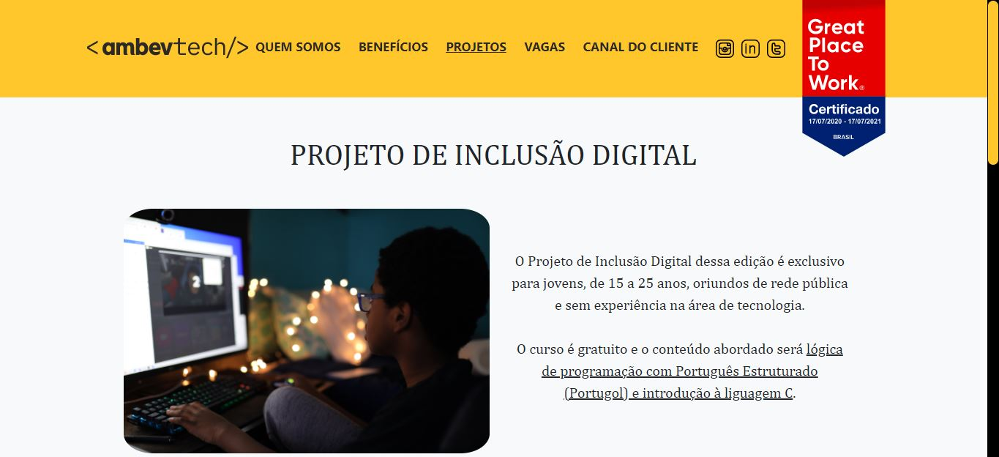
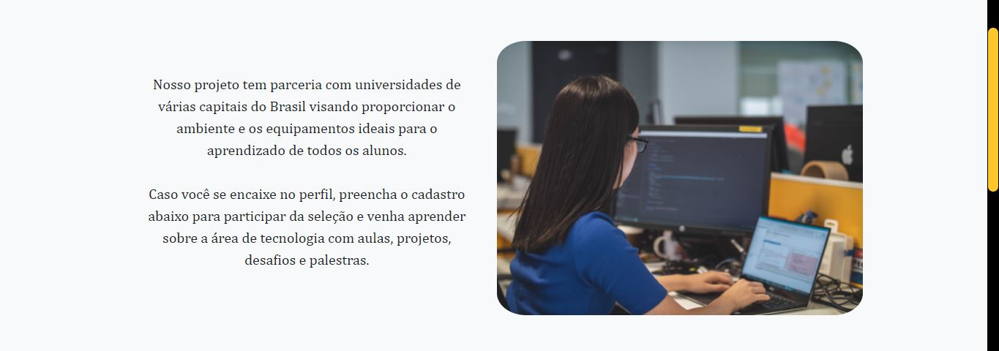
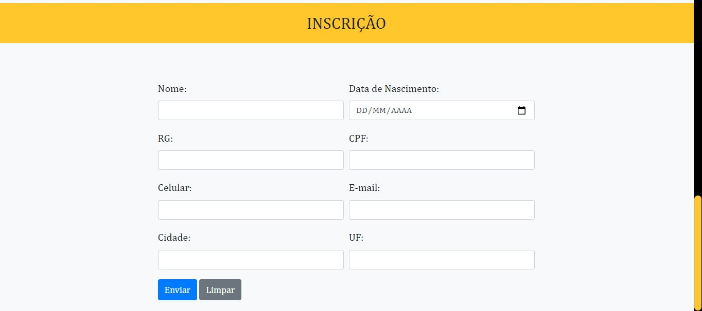

<h2>Interface - Ambev Tech</h2>

<h4>Desafio  #StartTech:</h4>

Sugestão de um projeto para unir as pessoas por um mundo melhor através da tecnologia.

Na página web desenvolvida, foram utilizados HTML, CSS, JavaScript e Bootstrap, além da criação de um formulário com uso de expressões regulares.

<h4>Aplicação:</h4>

Parte 1/3:

Parte 2/3:

Parte 3/3:

